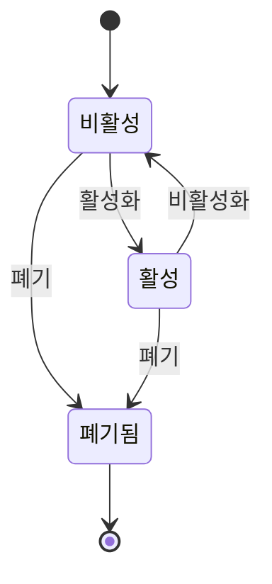

# IDEA — 클로저 기반 컴포넌트 수명 관리

- 작성일: 2026-10-10
- 기준: Lithent `main`, `0b685260ab204857d7e0adbd472d029528a31005`
- 상태: **아이디어 제안. 구현 착수 및 공개 API는 미결정.**
- 관련 후보 목록: [IDEAS.md](./IDEAS.md)

## 1. 핵심 아이디어

> **한 번 만든 로직과 상태를 유지하면서, 화면 연결과 작업의 수명을 함께 관리하는 작은 컴포넌트.**

클로저에 저장한 상태와 행동, 그 행동이 시작한 요청·타이머·구독을 하나의 인스턴스가 소유한다.
화면이 필요한 동안 활성화하고, 잠시 숨길 때는 상태를 보존하며 활동을 멈추고,
더 이상 필요하지 않을 때는 자원을 정리한다.

논의한 세 가지 방향은 이 수명 모델 위에 묶인다.

| 방향 | 통합 모델에서 맡는 역할 |
| --- | --- |
| 자원·비동기 작업 관리 | 인스턴스가 무엇을 소유하고 언제 정리하는지 정의하는 기반 |
| 화면을 닫아도 상태 보존 | 활성화·비활성화·폐기를 구분하는 수명 정책 |
| Custom Elements로 삽입 | 인스턴스를 기존 페이지에 연결하는 외부 인터페이스 |

클로저는 참조가 유지되는 동안 상태와 행동을 보존할 수 있는 기반이다.
요청 취소, 오래된 응답 차단, 작업 중단·재개, 렌더링 억제는 라이브러리가 추가로 제공해야 한다.
Custom Elements만으로 이 전체 동작이 자동으로 완성되지는 않는다.

## 2. 해결하려는 실무 문제

### 검색·비동기 작업

검색 A 이후 검색 B를 시작했는데 A의 응답이 늦게 도착해 B의 결과를 덮는다.
화면을 닫은 뒤에도 타이머와 구독이 살아 있고, 비동기 콜백이 폐기된 UI를 갱신하려 한다.
현재 값을 읽는 핸들러를 한 번 만들 수 있어도, 작업의 순서와 유효성은 별도로 관리해야 한다.

### 폼·편집기·탭

편집 화면을 잠시 닫거나 탭을 전환했을 뿐인데 입력값, undo 기록, 로컬 draft를 다시 구성해야 한다.
반대로 화면을 CSS로 숨기기만 하면 폴링과 화면 갱신이 계속 실행된다.
상태 보존과 활동 중단을 함께 표현하는 수명 모델이 필요하다.

### 기존 페이지에 넣는 위젯

CMS, 서버 템플릿, React·Vue 페이지에 독립적인 위젯을 삽입한다.
호스트는 연결·활성화·비활성화·폐기를 요청하고, 내부 인스턴스는 자신의 상태와 작업을 관리한다.
임시 DOM 이동과 실제 제거를 구분하고, 보존은 명시적으로 선택한다.

## 3. 이미 구현된 기반과 추가 제안

| 영역 | 현재 구현 | 이 문서에서 추가로 제안하는 것 |
| --- | --- | --- |
| 클로저 컴포넌트 | `mount` / `lmount`의 초기화와 업데이터 분리 | 보존할 인스턴스와 화면 연결의 수명을 명시적으로 표현 |
| 정리 콜백 | `mountCallback`의 반환 함수를 언마운트 시 실행 | 서로 다른 자원을 공통 소유 범위에 등록하고 일괄 정리 |
| effect | `effect`가 의존성 반환 함수로 업데이트 조건을 지정 | 활동 중단·재개와 effect 수명을 연결할 수 있는지 검토 |
| state-ref 연결 | 커넥터가 마운트 후 구독하고 언마운트 시 abort | 비활성화 시 UI 구독을 멈추고 재활성화 시 최신 값으로 연결 |
| Custom Elements | `lithent/element`의 속성·프로퍼티·이벤트·스타일 격리 | 수명 모델을 명시적으로 선택해 호스트와 연결 |
| DOM 이동 | 같은 태스크의 분리·재연결에서는 내부 상태 보존 | 장기 비활성화 및 재연결 시 보존 정책은 별도로 설계 |

현재 `lithent/element`는 분리 후 마이크로태스크에서 여전히 연결되지 않은 요소의 내부 컴포넌트를
언마운트한다. 같은 태스크의 DOM 이동을 지원하는 것과 장기간 닫힌 위젯을 보존하는 것은 다르다.
기존의 제거·정리 동작을 기본값으로 유지하고, 보존 기능은 opt-in으로 검토한다.

## 4. 제안하는 수명 모델

아래는 구현된 상태 머신이 아니라 설계 후보이다. 상태 이름과 API는 확정하지 않는다.

| 상태 | 보존되는 것 | 실행 정책 후보 |
| --- | --- | --- |
| 비활성 | 유지하기로 선택한 클로저 상태·행동·편집 기록 | UI 갱신 및 활동 자원 중단. 변경은 재활성화 시 한 번 반영 |
| 활성 | 같은 인스턴스와 상태 | 화면 연결, 구독·폴링·이벤트 처리 및 렌더링 허용 |
| 폐기됨 | 소유 범위의 참조를 해제 | 요청 취소, 결과 반영 금지, 자원 정리. 같은 인스턴스로 재활성화 불가 |

일반 재렌더링과 재활성화는 유지 중인 인스턴스의 초기화 로직을 다시 실행하지 않는 것을 목표로 한다.
완전 폐기 후 다시 만드는 것은 새 인스턴스이다. 비활성화 중 상태 쓰기를 허용하더라도
렌더링과 활동 재시작을 유발하지 않도록 구분한다.

자원은 적어도 두 종류로 구분할 필요가 있다.

- **인스턴스 자원:** 비활성화 중에도 유지할 모델·편집 기록 등의 자원. 폐기할 때 정리한다.
- **활동 자원:** 폴링·UI 이벤트·화면용 구독 등. 비활성화 때 정리하고 활성화 때 다시 생성한다.

취소한 `AbortSignal`은 재사용할 수 없으므로, 재활성화에는 새 활동 범위와 신호가 필요하다.
임의의 Promise나 JavaScript 실행을 일시정지했다가 이어 실행한다고 약속하지 않는다.

## 5. 소유 범위와 비동기 작업

컴포넌트 초기화 때 소유 범위의 핸들을 확보하고, 이벤트 핸들러나 `await` 이후에도
그 핸들로 자원을 등록할 수 있는 방식을 검토한다. 나중에 호출되는 코드에서
암묵적인 "현재 컴포넌트"를 추측하는 방식에 의존하지 않는다.

소유 범위가 제공할 책임의 후보는 다음과 같다.

| 책임 | 기대하는 동작 |
| --- | --- |
| 자원 등록 | 명시적으로 등록한 정리 함수를 소유한다. 폐기 중복 호출에도 한 번만 정리한다 |
| 활동 시작·정지 | 폴링·이벤트 리스너 등의 생성 함수와 정리 함수를 짝으로 관리한다 |
| 작업 취소 | 작업에 `AbortSignal`을 전달하고 비활성화·폐기 정책에 따라 취소한다 |
| 최신 작업만 반영 | 같은 작업 그룹의 이전 실행을 무효화하고, 최신 실행의 결과만 반영한다 |
| 결과 반영 경계 | 작업 성공·오류·pending 갱신도 실행 식별자와 활동 세대를 확인한 뒤 반영한다 |
| 정리 후 등록 | 폐기된 범위에 늦게 등록된 자원이 누수되지 않도록 처리 규칙을 정한다 |

**최신 상태를 읽는 것과 최신 작업의 결과만 반영하는 것은 다른 보장이다.**
요청을 시작할 때 검색어나 대상 ID를 캡처하고, 완료 시 해당 실행이 여전히 유효한지 확인해야 한다.
`abort()`를 호출해도 취소를 무시하거나 이미 완료된 작업의 응답은 도착할 수 있으므로,
결과 반영 자체를 제한하는 경계가 필요하다.

이 보장은 범위가 관리하는 결과 반영에 적용한다. 사용자 코드가 작업 도중 상태를 직접 쓰거나
외부 부수효과를 실행한 경우, 뒤에서 자동으로 되돌리지는 않는다.
서버 저장이 취소 신호로 롤백된다고 가정하거나, 결과가 불확실한 저장을 자동 재시도하지 않는다.

## 6. 상태 보존과 화면 연결의 설계 과제

모든 클로저 상태를 보존하려면 기존 컴포넌트 인스턴스를 유지해야 한다.
모델 객체만 따로 보존하고 컴포넌트를 새로 마운트하면, 컴포넌트 내부의 일반 `let` 변수까지
자동으로 복원되는 것은 아니다.

| 접근 | 보존 범위 | 검토할 비용 |
| --- | --- | --- |
| 컴포넌트·VDOM·DOM 유지 | 기존 클로저와 DOM을 유지하는 방향 | 메모리, 포커스·접근성, 숨겨진 DOM의 활동, portal 처리 |
| 모델 유지 + 화면 재생성 | 명시적으로 외부에 둔 모델 상태 | 컴포넌트 로컬 상태는 새로 생성. 별도 모델 작성이 필요 |

첫 보존 시연에서는 두 접근 중 하나를 명시적으로 선택하고, 지원 범위를 문서화한다.
입력값·undo 같은 애플리케이션 상태와 포커스·선택 영역·영상 재생 위치 같은 DOM 상태의
보존 여부도 따로 정의한다. 보존 개수·기간과 최종 폐기 책임을 정해 무제한 보유를 피한다.

## 7. 기존 생태계와의 관계

- 기본 컴포넌트 작성법과 작은 코어를 유지한다. 선택적 헬퍼 또는 별도 진입점으로 가능한지 먼저 확인한다.
- state-ref를 필수 의존성으로 강제하지 않는다. 일반 클로저 변수와 명시적인 `renew`도 대상이다.
- 기존 state-ref 커넥터와 query 소유권을 재사용하거나 연결한다. 독립적인 캐시·query 체계를 새로 만들지 않는다.
- Custom Elements는 외부 어댑터로 사용한다. DOM 분리가 비활성화인지 폐기인지는 명시적인 보존 정책으로 결정한다.
- base와 concurrent 코어 모두에서 검토한다. 실제 부수효과는 마운트가 확정되는 시점에 시작하고,
  커밋되지 않은 초기화 시도가 외부 자원을 남기지 않도록 한다.
- 렌더링 취소와 네트워크 작업 취소를 별개로 취급한다. concurrent의 상태 스냅샷이나 transition 보장을 추가한다고 주장하지 않는다.
- SSR에서 import·상태 구성만으로 타이머, 브라우저 구독, 자동 네트워크 작업이 시작되지 않도록 한다.

## 8. 킬러 포인트로 전달할 메시지

핵심은 클로저라는 언어 기능 자체보다 **유지되는 로직, 명확한 소유권, 통합된 수명 관리의 사용 경험**이다.

> 한 번 만든 로직과 상태를 유지하고, 필요한 동안 화면에 연결하며, 작업의 시작과 끝까지 함께 관리한다.

"규칙 없는 훅", "stale closure 완전 제거", "제로 코스트 Context"는 보장으로 내세우지 않는다.
초기화 때 값을 복사하면 이후 변경이 자동으로 반영되지 않으며, 렌더링·effect 의존성 추적은
소유권과 다른 문제다. 클로저 캡슐화만으로 순수 함수나 상태 머신이 만들어지지도 않는다.

Solid의 `createRoot`, Vue의 `effectScope`처럼 소유 범위를 다루는 기존 기능도 있다.
따라서 독점적인 원리라고 주장하기보다, 작은 VDOM·명시적 갱신·Custom Elements와 결합했을 때
얼마나 적은 코드로 실무 문제를 해결하는지 시연하고 비교해야 한다.

## 9. 검증할 최소 시연과 단계

**시연 후보: 기존 CMS 페이지에 삽입하는 검색·편집 위젯.**

| 동작 | 확인할 결과 |
| --- | --- |
| 느린 검색 A 직후 빠른 검색 B | A가 나중에 완료돼도 B의 결과·오류·pending을 덮지 않는다 |
| 편집 후 위젯 비활성화 | 입력값·편집 기록은 유지되고 폴링·화면 갱신은 중단된다 |
| 비활성화 중 외부 상태 변경 | 재활성화 시 최신 값으로 연결되며 구독·타이머가 중복되지 않는다 |
| 비활성화 직후 다시 활성화 | 이전 활동 세대의 응답이 새 화면에 반영되지 않는다 |
| 최종 폐기 및 중복 폐기 | 자원을 한 번만 정리하고 늦은 응답·렌더 예약이 인스턴스를 되살리지 않는다 |
| Custom Element 이동·제거 | 기존 이동 보존·제거 정리 동작을 유지하고, 추가 보존은 선택한 경우에만 적용한다 |

1. **소유권부터 검증:** 자원 등록·최종 정리, 작업 취소·최신 결과 반영 경계를 작은 프로토타입으로 확인한다.
2. **활동 수명 추가:** 활성화·비활성화와 작업 재시작 규칙을 정한다. 인스턴스·화면 보존 전략도 선택한다.
3. **호스트 연결:** 같은 모델을 일반 Lithent 화면과 Custom Element에서 시연하고 base·concurrent 호환을 확인한다.

착수가 결정되면 기능별 문서 폴더에 REQUIREMENTS / DESIGN / IMPLEMENT /
MANUAL_TEST_CHECKLIST를 작성한다. 이 문서만으로 공개 API나 기존 수명 계약을 변경하지 않는다.

## 10. 관련 구현과 참고 자료

- [클로저 컴포넌트 구성](../../src/wDom.ts)
- [mountCallback 및 정리 등록](../../src/hook/mountCallback.ts)
- [언마운트 정리](../../src/hook/internal/unmount.ts)
- [현재 effect 헬퍼](../../helper/src/hook/effect.ts)
- [Custom Elements 구현](../../element/src/index.ts), [사용 안내](../../element/README.md), [요구사항](../element/REQUIREMENTS.md)
- [Concurrent 수명·커밋 계약](../../lithentConcurrent/README.md)
- [state-ref Lithent 커넥터](https://github.com/superlucky84/state-ref/blob/main/packages/connect-lithent/src/index.ts)
- [Solid createRoot](https://docs.solidjs.com/reference/reactive-utilities/create-root)
- [Vue effectScope](https://vuejs.org/api/reactivity-advanced.html#effectscope)
